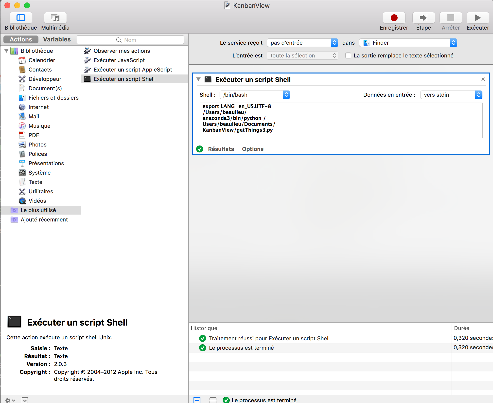
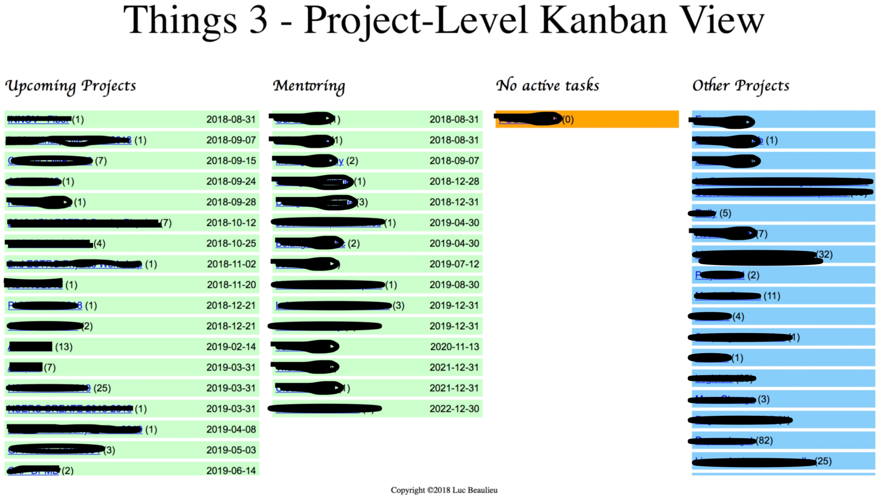

# KanbanView for Things 3

This script will create a visual task-level overview (Kanban) of what is on your plate in [Things3](http://culturedcode.com) by generating an HTML file.


This project has been refactored massively and the old documentation follows.

## Content

It is comprised of 3 files:

- a python script
- a CSS file and
- a PDF README file

It can be executed from the terminal or as a system service using the
macOS Automator app (thus never needing to open a terminal and can be
associated to a keyboard short cut).

## Disclaimer

I am a physicist not professional programmer. This means that the code work but by no means that it is the most efficient or nicest piece of scripting you have ever seen. In fact, at this point in time, I have made no effort to clean, to subdivide or to make the code more compact.

This script is provided as is. You are free to modify any file as you see fit. If you do use it and like it, please do share this post. If you do modify script and make it better, I would like to hear about / share it in the comment section!

## What does it do

The python script will extract the information in Things 3 SQLite3 database (assumed to reside in its std place on your hard drive. As such, you only need to change the username from beaulieu to yours and it should work!) and separate it in upcoming projects i.e. active projects (type=1 and status =0) with due dates(dueDate!=0), active projects that have no active tasks and finally, all other active projects.

It will then build on the fly an html file call KanbanView.htm, using the 3col.css file containing all of the style information, and automatically start your browser view of the file once completed (webbrowser.open_new_tab(filename)).

**Note**: The CSS file is easy to modify to add one or more columns. I myself use a 4-column version, where I separate the Mentoring area projects (between 15 and 20) from the other upcoming projects.

## What it is meant for

Provide a visual cue of each project that is on your plate at the moment, in particular those with due dates. This is akin of something in-between the 10 000 and 20 000 feet altitude review in David Allan GTD book.

This is helpful in two aspects:

1. After the weekly review to make sure you did not forget something obvious (e.g. the No Active Task column should be empty!)
2. Anytime you need to make a decision about committing to a new project, have an overview of what is actually ON your plate. This will help you saying yes or, more importantly, saying no!

## What it is NOT meant for

It does not replace your task manager in the day-to-day operation. Things should be the place to be for that. More importantly, it does not replace the crucial weekly review. As written previously it could supplement it and provide a more visual and quick access to your active projects, but that is it. Finally, if you do have extremely complex projects, it does not replace something like OmniPlan or Microsoft Project.

## Files included and where they should go

Download the zip file [here](archive/master.zip). Unzipping will show a folder that contains:

- getThings3.py: the main python script
- 3col.css: ccs style for on the fly html visualization style (column definition, color, independent scrolling, ...)
- README.md: self-explanatory!

Next:

1. Place the folder KanbanView at the location of your choice (I suggest your Document folder)
2. Edit the getThings3.py file using your favorite plain text editor (Apple TextEdit will do!) and change the following two lines at the top (lines 9-10) that tell Python where the location of your Things 3 database and the path of your KanbanView folder for the html file that will be created and automatically open for you:

```text
# Basic file info
# Simply replace abeaulieua below with your own user name
sqlite_file = '/Users/beaulieu/Library/Containers/com.culturedcode.ThingsMac/
Data/Library/Application Support/Cultured Code/Things/Things.sqlite3'
fout = '/Users/beaulieu/Documents/KanbanView/kanban.html'
```

## What you need on your Mac

- Latest version of Things 3
- Python 3.6 (it might run with python 2.7 that is installed by default on macOS (10.13 and earlier) but I have not tested it.
- Safari (I have not tested it with anything else but I am using only std html, nothing fancy)

## To run - method 1 - the terminal

- Open a terminal
- Move to your KanbanView folder: cd ./Documents/KanbanView assuming you save the folder where I told you earlier.
- Then simply do: python getThings3.py
- If all paths were set correctly as indicated before at the top of getThings3.py, you will:
  - See your Kanban on your screen, in your favorite browser.
  - See also that each entry has a clickable link that open that given project back in Things. You will likely get a message box asking permission to Things to do it, just say yes and look at your Things 3 app!

## To run - method 2 - set up as a System Service (never need to open a
terminal or run python once it is installed!)

- Open the Automator app (in the Application folder)
- Chose « run shell script » as in the box below:



In Automator, pick a new System service and then « run a shell script » with /bin/bash, stdin as input as shown. At the very top, the service received no input and select Finder. You see that the shell has only two lines. The first one set the text encoding. This is necessary because in Automator the default is different from that set in your system environment when running from the Terminal. The second line is simply running the script!

- Next, assign it to a keyboard combination so that you can call (or refresh) your Kanban view on the fly, as displayed below.


In the Keyboard system preference panel, chose Shortcut at the top and Services on the left side, go to the bottom where you should see KanbanView (as shown above). Just assign it to an unused combination of keys. You can see that in my case, I already have a bunch of scripts to work with my e-mails, DevonThink and Things.

Whether choosing method 1 or 2, you will see you Kanban display in your browser. In my case, I use a 4-column display. In your case, this vanilla release will produce three columns presented in the past post: Upcoming Projects, No Active Tasks and Other Projects. Note that each column as independent scrolling, which is quite helpful.



## Final note - What would be nice in the future

- For Cultured Code to implement a Kanban View with various filters ;-)
- For me (or a volunteer) to implement an on-the-fly choice of 3, 4 or n-columns display with user-defined choice of the information contained in each column.

As Cespenar says: enjoy!

