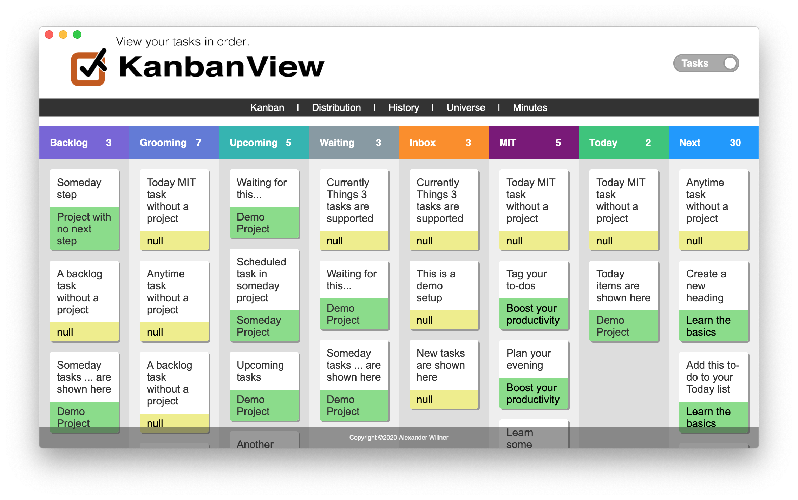

[](https://github.com/AlexanderWillner/KanbanView/releases)
[](https://github.com/AlexanderWillner/KanbanView/releases)
[](https://github.com/AlexanderWillner/KanbanView/issues)
[](https://scrutinizer-ci.com/g/AlexanderWillner/KanbanView/?branch=master)
[](https://travis-ci.com/AlexanderWillner/KanbanView)
[](https://coveralls.io/github/AlexanderWillner/KanbanView?branch=master)

# CLI, API, Web Service and Kanban for Things 3

This repository contains a simple read-only CLI, API and Web Service for [Things3](http://culturedcode.com). It further includes an example web application to create a visual task-level overview (Kanban) of what is on your plate. Star, fork and contribute to the repository or download a [release](https://github.com/AlexanderWillner/KanbanView/releases).



## Commands

The available commands are listed by executing `make`:

```bash
$ make
CLI, API and Web Service for Things3.

Configuration:
 * Static Kanban : src/kanban-static.html
 * Dynamic Kanban: http://localhost:8088/kanban.html

Avaliable environment variables:
 * THINGSDB    - Path to database
 * TAG_WAITING - Tag for tasks you are waiting for
 * TAG_MIT     - Tag for most important tasks

Available commands:
 * run          - Run code in static mode.
 * run-server   - Run code in server mode.
 * open         - Open GUI in static mode.
 * open-server  - Open GUI in server mode.
 * kill-server  - Kill a running server.
 * app          - Create KanbanView App.
 * test         - Run unit tests and test coverage.
 * doc          - Document code (pydoc).
 * clean        - Cleanup (e.g. pyc files).
 * auto-style   - Automatially style code (autopep8).
 * code-style   - Check code style (pycodestyle).
 * code-lint    - Check code lints (pyflakes, pyline, flake8).
 * css-lint     - Check CSS styke lints (csslint).
 * js-lint      - Check JS code lints (jslint).
 * html-lint    - Check HTML file lints (tidy).
 * code-count   - Count code lines (cloc).
 * deps-install - Install dependencies (see requirements.txt).
 * deps-update  - Update dependencies (pur).
 * deps-create  - Create dependencies (pipreqs).
 * feedback     - Create a GitHub issue.
```

## Command Line Interface (CLI)

The CLI allows you to access the Things3 database via the comand line:

```bash
$ ./src/things3_cli.py inbox
 -  Inbox Todo  ( None )
```

It is also possible to get the information formatted as ```json``` strings:

```bash
$ $ ./src/things3_cli.py --json next | jq
[
  {
    "uuid": "9CD92553-95D7-4CF2-B554-F1DE9F563018",
    "title": "Due Todo",
    "context": "Next Project",
    "context_uuid": "DED787E0-874A-4783-8F0F-0A02F87F8419",
    "due": "2152-08-28"
  },
  {
    "uuid": "4C5D620C-165C-41D2-BC5B-A34065348D92",
    "title": "Today Project Todo",
    "context": "Today Project",
    "context_uuid": "52ADBAB5-A0EC-4D3F-BF83-2D578DAE3AF3",
    "due": null
  },
  {
    "uuid": "2ECBE4AA-2E3F-49CC-AA38-CBFFBFD2B1FD",
    "title": "Todo with Checklist",
    "context": "Next Project",
    "context_uuid": "DED787E0-874A-4783-8F0F-0A02F87F8419",
    "due": null
  },
  {
    "uuid": "709794DA-EB89-4A1B-BBE5-2BF8424BBA28",
    "title": "Waiting for Todo",
    "context": "Next Project",
    "context_uuid": "DED787E0-874A-4783-8F0F-0A02F87F8419",
    "due": null
  }
]
```

However, the CLI is only in a beginning state. The original ```bash``` based version can be found at [another GitHub repo](http://github.com/alexanderwillner/things.sh). Overall commands are:

```bash
$ ./src/things3_cli.py -h
usage: things3_cli.py [-h] [-j] [-c] [--version] command ...

Simple read-only Thing 3 CLI.

positional arguments:
  command         One of the following commands:
    inbox         Shows all inbox tasks
    today         Shows all todays tasks
    upcoming      Shows all upcoming tasks
    next          Shows all next tasks
    someday       Shows all someday tasks
    completed     Shows all completed tasks
    cancelled     Shows all cancelled tasks
    trashed       Shows all trashed tasks
    feedback      Give feedback
    all           Shows all tasks
    csv           Exports all tasks as CSV
    due           Shows all tasks with due dates
    headings      Shows all headings
    hours         Shows how many hours have been planned today
    ical          Shows all tasks ordered by due date as iCal
    logbook       Shows all tasks completed today
    mostClosed    Shows days on which most tasks were closed
    mostCancelled
                  Shows days on which most tasks were cancelled
    mostTrashed   Shows days on which most tasks were trashed
    mostCreated   Shows days on which most tasks were created
    mostTasks     Shows projects that have most tasks
    mostCharacters
                  Shows tasks that have most characters
    nextish       Shows all nextish tasks
    old           Shows all old tasks
    projects      Shows all projects
    repeating     Shows all repeating tasks
    schedule      Schedules an event using a template
    search        Searches for a specific task
    stat          Provides a number of statistics
    statcsv       Exports some statistics as CSV
    subtasks      Shows all subtasks
    tag           Shows all tasks with the waiting for tag
    tags          Shows all tags ordered by their usage
    waiting       Shows all tasks with the waiting for tag

optional arguments:
  -h, --help      show this help message and exit
  -j, --json      output as JSON
  -c, --csv       output as CSV
  --version       show program's version number and exit
```

## Application Programming Interface  (API)

The API allows you to access the Things3 todos within other Python scripts:

```bash
$ make doc
...
class Things3(builtins.object)
     |  Things3()
     |  
     |  Simple read-only API for Things 3.
     |  
     |  Methods defined here:
     |  
     |  get_anytime(self)
     |      Get anytime tasks.
     |  
     |  get_inbox(self)
     |      Get all tasks from the inbox.
...
```

## Web Service

The web service allows you to access the Things3 database via a web service:

```bash
$ make run-server
Starting up...
Serving API at http://localhost:8088/api/{command}
```

Via ```curl``` you can browse the ```json``` data via command line:

```bash
$ curl -s http://localhost:8088/api/today | jq
[
  {
    "uuid": "D7D879D2-5A2D-48AA-AF8A-AADCEC228D2B",
    "title": "Today Todo",
    "context": "Today Project",
    "context_uuid": "52ADBAB5-A0EC-4D3F-BF83-2D578DAE3AF3",
    "due": null
  }
]
```

## Kanban Application

The Kanban Application allows you to visualize the Things3 database following the Kanban approach. There are different implementations of the application available.

The **static** version creates a snapshot of the current status and writes an HTML file to ```kanban-static.html```: `make run`.

The **dynamic** version runs a web application at [http://localhost:8088/kanban.html](http://localhost:8088/kanban.html) and updates the GUI via JavaScript automatically using the **Web Service**: `make run-server`.

The **KanbanView.app** version encapsulates the **dynamic** version in a macOS bundle (alpha). Note: when you download the pre-compiled binary, as the App is not digitally signed, you need to execute the following command once, after you've copied the bundle to the Applications folder: `xattr -rd com.apple.quarantine /Applications/KanbanView.app`
